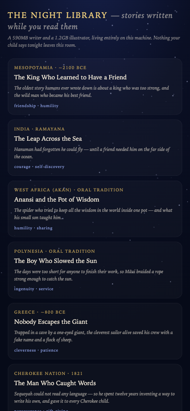
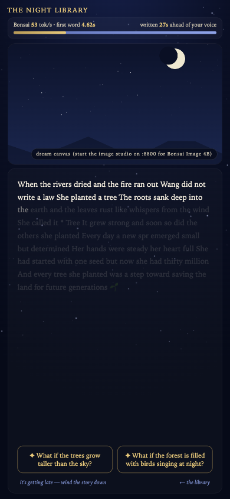

# The Night Library

*There is a library that only opens after dark. It has no shelves and no cloud.
It lives inside the machine on your desk — a writer the size of a photo album and a
painter the size of a home movie — and every night it writes your child a story that
has never existed before, faster than you can read it aloud.*

**A real-time, fully-local bedtime storyteller built on PrismML's Bonsai models.**
The 590MB Ternary-Bonsai-1.7B writes. The 1.2GB Bonsai Image 4B illustrates.
Nothing your child says, chooses, or hears ever leaves the room.

<p>
  
  
</p>

## First light in five minutes

You need a Mac (Apple Silicon) and two commands. No accounts, no keys.

```bash
# 1. The writer — stock Homebrew llama.cpp, no forks
brew install llama.cpp
llama-server -m Ternary-Bonsai-1.7B-F16.gguf --port 8080 -ngl 99
#    model file: huggingface.co/prism-ml/Ternary-Bonsai-1.7B-gguf

# 2. The library
./scripts/serve.sh        # → open http://127.0.0.1:8400/web/
```

Pick a story. Watch the meter at the top: the blue bar is Bonsai writing
(~60–125 tok/s), the gold bar is you, reading aloud (~2.6 words/s). The page shows
it too — words ahead of your voice sit faint on the page, like ink waiting for
light. When your child interrupts to choose what happens next, the next page
begins in **about 0.2 seconds** — faster than doubt.

**Want pictures?** The library paints a procedural "dream canvas" out of the box.
For real illustrations, run PrismML's image studio next to it:

```bash
git clone https://github.com/PrismML-Eng/Bonsai-Image-Demo && cd Bonsai-Image-Demo
./setup.sh                              # uv + mflux + model (~3.9GB, Apache 2.0)
BACKEND_PORT=8800 ./scripts/serve.sh    # the library finds it automatically
```

## Choose your door

| If you are… | Read… | You'll walk away able to… |
|---|---|---|
| **here for tonight's story** | you're done — go pick one | run it for someone you love |
| **wondering why this matters** | [BONSAI_101.md](BONSAI_101.md) | explain intelligence density, with numbers, to anyone |
| **PrismML team / community** | [docs/FIELD_GUIDE.md](docs/FIELD_GUIDE.md) | extend the canon, swap backends, reuse the patterns |
| **a hard-parts person** | [docs/UNDER_THE_HOOD.md](docs/UNDER_THE_HOOD.md) | trace every byte from the model to the moonlight |

## What's in the building

```
web/index.html      the whole app — one file, no build step, view-source friendly
canon/canon.json    twelve seeds from twelve civilizations, each with a truth note
canon/RUBRIC.md     what "best bedtime story in civilization" means, measurably
studio/judge.py     Bonsai scores stories against the rubric (grammar-pinned)
BONSAI_101.md       the big idea: intelligence density, vs-SOTA, device math
docs/               the field guide and the under-the-hood walkthrough
```

---

*Part of the Bonsai field-study world — the footgun ledger and the chronicle live at
[the-little-tree-thinks](https://github.com/ChaiWithJai/the-little-tree-thinks).
Stories belong to the civilizations that first told them; this library just keeps
the night shift.*
